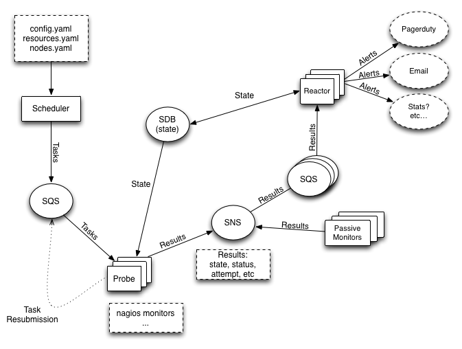

.. NYMMS documentation master file, created by
   sphinx-quickstart on Thu Oct 17 11:08:51 2013.
   You can adapt this file completely to your liking, but it should at least
   contain the root `toctree` directive.

=================================
Welcome to NYMMS's documentation!
=================================

NYMMS is a monitoring system written in python that takes influences from
many of the existing monitoring systems.  It aims to be easy to scale and
extend.

Demo
====

Before we get into the guts of NYMMS I'd like to mention that we build a
demonstration Amazon AMI that comes up with a basic configuration for an
all-in-one NYMMS host that runs all of the daemons.  To get more information
on how to use that, please visit :doc:`Demo AMI <demo>`

Scaling
=======

NYMMS intends to scale as easily as possible.  It does so by separating out
the work often handled in a monitoring system into multiple processes, and then
handling communication between those processes with queues.  None of this is
revolutionary (Shinken_ broke the Nagios_ daemon up into many small pieces,
and Sensu_ made heavy use of queues, and all of them are excellent
monitoring systems that we take heavy influence from)- but I'm hoping to bring
the two together in useful ways.

Architecture Diagram
--------------------

The Daemons
-----------

**nymms-scheduler:**
    The daemon responsible for reading in the configuration, figuring out what
    it is you want to monitor and how you want to monitor those things, and
    then submitting tasks to the queue for probes.

**nymms-probe:**
    The daemon(s) responsible for reading from the task queue and taking those
    monitoring tasks and executing them.  It sends along the results of those
    monitors to the results topic.

**nymms-reactor:**
    The daemon(s) that takes all the results, applies filters to them and then
    passes off the results that pass the filters onto their various handlers.
    Handler's can do just about anything with the results, from emailing people
    to triggering an incident in PagerDuty_, to submitting stats to a stats
    system.  Finally the reactor updates the state database with the result.

Communication
-------------

I've tried to keep the interface with the various communication channels
simple and easily extendible. As of this writing the entire system is very
AWS_ based.  We make use of the following AWS_ services:

**SQS:**
    We use SQS as our general queue service.  The scheduler passes tasks to the
    probes via SQS directly.  The reactors read the results from the probes off
    SQS queues (note that the probes don't send results directly through SQS,
    which leads us to...)

**SNS:**
    Probes submit results into SNS topics, which then pass them onto the
    reactors' SQS queues.  This allows a single result to be shared amongst
    multiple types of reactors, as well as allowing results to be sent to
    various other endpoints.

**SDB:**
    We use AWS_ SimpleDB to store state.  This state database is written to by
    reactors when they receive results.  It's read from by probes (to make sure
    we aren't beating a dead horse when something is down and has been down for
    some time) and by the reactors (to allow for logic regarding reacting to
    results that have changed state, or have been in a state for some length of
    time).

**SES:**
    We use AWS_ Simple Email Service in some reactor handlers in order to be
    able to easily send email.

Each of these services is used fairly lightly in most cases, so the charges
should be minimal in almost all cases.  The upside is that we currently do not
require physical servers for any of these functions, which inevitably cost
a significant amount to build and maintain.

In the future it should be fairly easy to convert these services to other
systems (such as RabbitMQ_, MongoDB_, etc).

Other Details
-------------

Right now all monitors are active monitors - they are fired from the probes and
contact other services via various protocols to determine if the service is in
an okay state.  Because of the design using the various queues however, it
should be simple in the future to submit passive results.  The reactors are
very permissive in accepting data from just about any source just as long as
it comes from their queue and it fits the correct dataformat.

As well we use a plugin format identical to the Nagios_ format.  The benefit
of this is that there is a vast wealth of nagios plugins out there, and they
can be used as is with NYMMS.  In the future we may come up with other plugin
formats, but we haven't had a reason to so far.

========
Contents
========

.. toctree::
   :maxdepth: 2

   config
   demo
   getting_started

==================
Indices and tables
==================

* :ref:`genindex`
* :ref:`modindex`
* :ref:`search`

.. _Shinken: http://www.shinken-monitoring.org/
.. _Nagios: http://www.nagios.org/
.. _Sensu: http://sensuapp.org/
.. _PagerDuty: http://www.pagerduty.com/
.. _AWS: http://aws.amazon.com/
.. _RabbitMQ: http://www.rabbitmq.com/
.. _MongoDB: http://www.mongodb.org/
